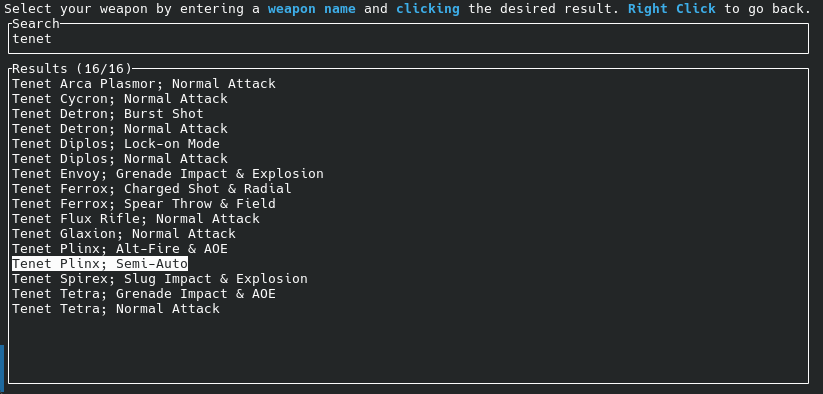
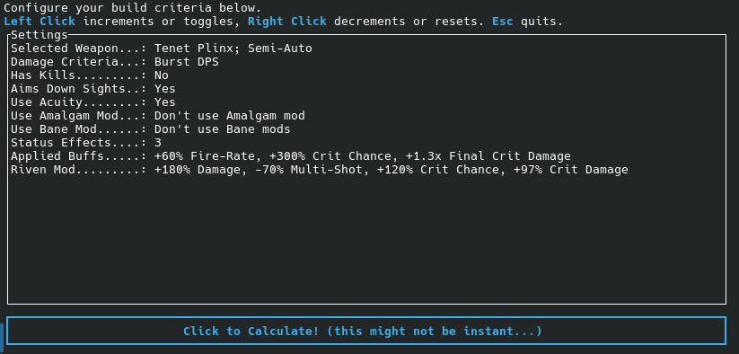
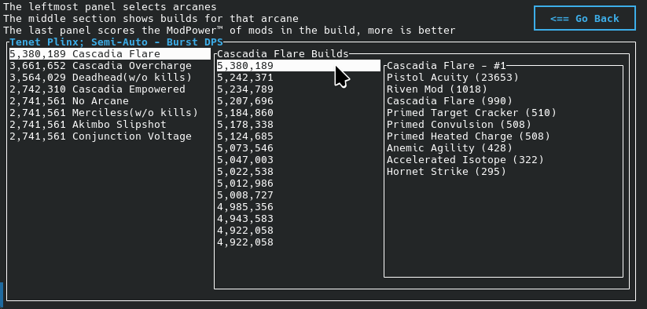
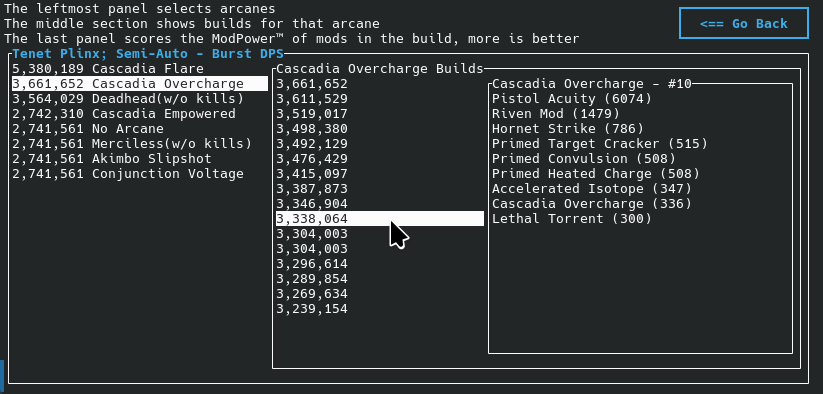

# wf optimizer
## Who needs fancy algorithms when a problem can be brute-forced?!
That's right! Why spend time trying any build when you could instead just try *all* 
the builds!

[Download the latest in Releases](https://github.com/ReallyMadHermit/wf_optimizer/releases)
### Start by searching a weapon

### Tweak your desired build criteria and usage context...

### Behold the results, on a per-arcane basis!

### The best is on top, but each arcane shows the best 16 builds

### ...But it's not *perfect* (yet)
It's neither perfect, nor infallible, nor promising the practically most powerful 
builds, only numerically strongest, and calculated simply. As such, please keep 
in mind some of its (current) shortcomings:
* All weapons are calculated using the same workflow
  * No magazine size scaling for plinx alt fire...
  * No crit chance status shenanigans for the dera...
  * No more than 1 ammo is assumed to be used per-shot
  * No implicit weapon stats such as sniper scope bonuses or firerate on headshot (use buff effects)
  * No weapon augments (Rivens and buff effects can be used as temporary shortcuts)
* The mod & weapon data the tool uses is curated and manually supplied
  * Weapons just have "damage" there is no damage typing
  * There are no physical damage mods in the pool
  * New weapons, mods, and arcanes will need to be added manually with updates
* Status is not accounted for in any way beyond the affects of Condition Overload and Cascadia Empowered
* Melee Weapons are not supported at all
* Incarnon Weapons and kitguns are not supported
  * There used to be a custom weapon workflow to address these, and that will be added again ina future version
* Situational or contextually scaling arcanes just assume you meet their criteria or conditions, and it is not guaranteed and you will benefit from a suggested arcane

However! None of these shortcomings are permanent, they are a consequence 
of the design process of making this tool, and will hopefully all be addressed 
in the future.
### Despite its shortcomings, it's still very helpful
The main appeal of the tool now is the power score each mod in a build is given, 
and it's functionally 10x the % impact of a give mod. So the frequently 
displayed strength of Galvanized Chamber is 2300, meaning it provides a 230% 
damage increase when applied, assuming all other mods in the build are 
present when the mod is added.

This function is especially useful when evaluating riven mods, 
and the tool used to give you a quick and simple "Your riven score is: 380!" 
and I will be restoring that feature soon, but in the meantime, you can assess 
rivens by just looking at the biggest number and trying to remember it as you 
change the riven stats between build calculations. The riven mod is also rated 
like any other mod, so you can just remember that number instead, if you prefer.

<a href="https://github.com/ReallyMadHermit/wf_optimizer/">wf optimizer</a> 
© 2025 by <a href="https://github.com/ReallyMadHermit">ReallyMadHermit</a> 
is licensed under <a href="https://creativecommons.org/licenses/by-nc-sa/4.0/">
CC BY-NC-SA 4.0</a>